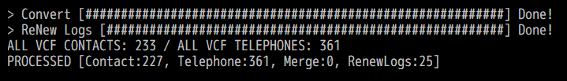
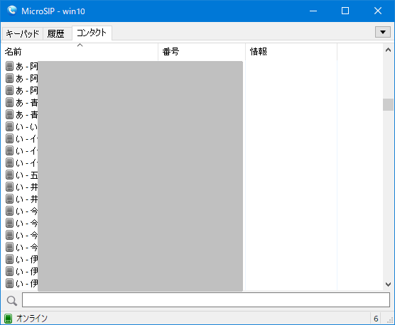

# vcf2msip

Google contacts (.vcf:iOS) to MicroSIP contacts converter, for Windows.

> MicroSIP - open source portable SIP softphone based on PJSIP stack for Windows OS.  
> https://www.microsip.org/

# Install
Place the executable file in any path.
vcf2msip is don't use the registry.

## Usage
vcf2msip [OPTIONS] "path\to\load\*.vcf" "path\to\save\Contacts.xml" ["%PATTERN%"]

---- OPTIONS ----  
["-m", "--merge"]       ... Merge from exist MicroSIP contacts too. Default: no merge.  
["-n", "--no-bup"]      ... Do not create backup. Default: create backup.  
["-r", "--renew-logs"]  ... Renew name in logs tab. Default: no touch.  
["-h", "-v", "--help", "--version"] ... This message.  

---- PATTERN ----  
- Pattern of convert to name from vcf contact.
- Apply to Name column in MicroSIP contacts (and logs, if --renew-logs) tab.
- Emptied () and [] are remove at all last.
- Default: "%linitial% - %name% (%teltype%)"  
"%name%"        ... Full name or Organization name.  
"%finitial%"    ... Initial of first name or %name%  
"%linitial%"    ... Initial of last name or %name%  
"%teltype%"     ... Telephone type.  
"%categories%"  ... Categories string.  

### e.g.

    vcf2msip --renew-logs C:\DeskTop\contacts.vcf C:\Users\<USERNAME>\AppData\Roaming\MicroSIP\Contacts.xml

then copied to this

    C:\Users\<USERNAME>\AppData\Roaming\MicroSIP\Contacts.xml.bup0001
    C:\Users\<USERNAME>\AppData\Roaming\MicroSIP\MicroSIP.ini.bup0001

and over write to this

    C:\Users\<USERNAME>\AppData\Roaming\MicroSIP\Contacts.xml
    C:\Users\<USERNAME>\AppData\Roaming\MicroSIP\MicroSIP.ini

## Screen shot

## License
MIT license http://opensource.org/licenses/MIT, or Unlicense.

## Links
- https://github.com/mar-m-nak/vcf2msip
